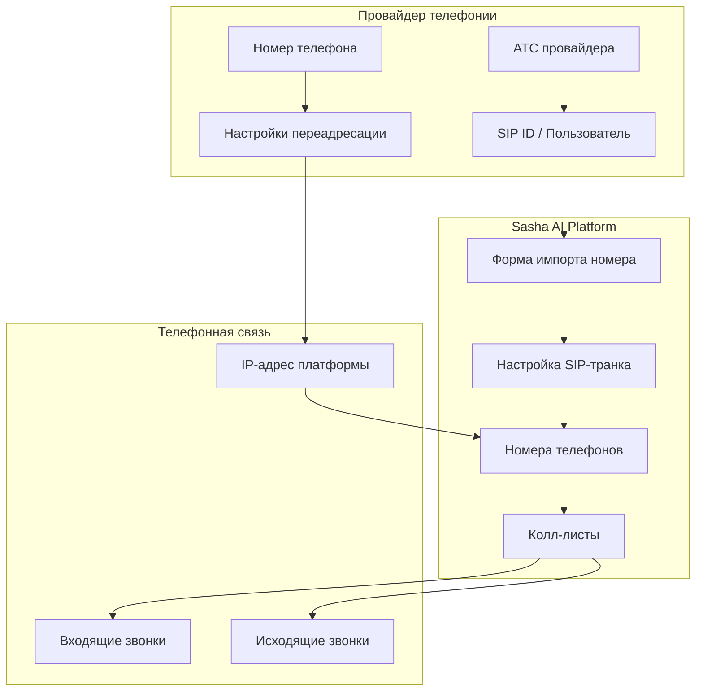

Начнем с основного канала коммуникации. Саша умеет совершать исходящие вызовы с нашей корпоративной телефонии, а также может работать с вашей собственной АТС через SIP-транки.

## Подключение собственной телефонии

Теперь вы можете подключить Sasha AI к вашей собственной АТС через SIP-транк. Это позволит использовать ваши номера телефонов для исходящих звонков и принимать входящие вызовы.

### Что такое SIP-транк?

**SIP-транк (SIP Trunk)** — это цифровой канал связи, который позволяет передавать голосовые вызовы через интернет между различными телефонными системами. 

Простыми словами: это мост между вашей АТС и нашей платформой, который позволяет Саше звонить с ваших номеров и принимать входящие вызовы.

## Пошаговая настройка

<Tabs>
  <Tab title="МТС Exolve">
    <Steps>
      <Step title="Создание SIP ID в МТС Exolve">
        1. Перейдите на [dev.exolve.ru/sips](https://dev.exolve.ru/sips)
        2. Создайте новый SIP ID
        3. Получите учетные данные:
           - **Username** (имя пользователя)
           - **Password** (пароль)  
           - **Domain** (домен)
      </Step>

      <Step title="Импорт номера с настройкой SIP-транка">
        1. В сайдбаре нажмите **"Номера телефонов"**
        2. Нажмите **"Импортировать номер"**
        3. Заполните основную информацию:
           - **Лейбл** — название для удобства
           - **Номер телефона** — ваш номер
        4. В разделе **"Настройка SIP-транка"** введите данные из МТС Exolve:
           - **Хост SIP-сервера** — домен из МТС Exolve
           - **Имя пользователя** — username из МТС Exolve
           - **Пароль** — password из МТС Exolve
        
        <Note>
        Запишите IP-адрес нашей телефонии: **176.124.219.217** — он понадобится на следующем шаге.
        </Note>
      </Step>

      <Step title="Настройка SIP-транка в МТС Exolve">
        1. Вернитесь на [dev.exolve.ru/sips](https://dev.exolve.ru/sips)
        2. Создайте новый SIP-транк
        3. Укажите IP-адрес нашей телефонии: **176.124.219.217**
        4. Закрепите номер телефона для исходящих вызовов
        5. Нажмите **"Создать SIP-транк"**
        6. Вернитесь в нашу форму и нажмите **"Добавить номер"**
        
        <Tip>
        Теперь ваш номер готов для исходящих звонков через созданный SIP-транк!
        </Tip>
      </Step>

      <Step title="Настройка приема входящих вызовов">
        1. Перейдите на [dev.exolve.ru/numbers](https://dev.exolve.ru/numbers)
        2. Откройте настройки вашего номера
        3. Перейдите в таб **"Переадресация"**
        4. Настройте переадресацию на созданный SIP-транк
        
        <Info>
        Это перенаправит входящие звонки на ваш номер к нашей АТС для обработки.
        </Info>
      </Step>

      <Step title="Привязка номеров к колл-листу">
        1. Откройте нужный колл-лист или создайте новый
        2. Перейдите в таб **"Управление"**
        3. Найдите раздел **"Номера телефонов"**
        4. Выберите номера для:
           - **Исходящих звонков** (карусель)
           - **Приема входящих вызовов**
        
        <Note>
        При входящем звонке Саша будет использовать тот же скиллбейз, каналы связи и вебхуки, что и для исходящих звонков.
        </Note>
      </Step>
    </Steps>
  </Tab>
  
  <Tab title="OnlinePBX">
    <Steps>
      <Step title="Настройка номера и SIP-пользователя в OnlinePBX">
        1. В панели OnlinePBX настройте **номер от оператора**
        2. Создайте **SIP-пользователя** (SIP ID)
        3. Настройте **переадресацию** с номера оператора на SIP-пользователя
        4. Получите учетные данные SIP-пользователя:
           - **Username** (имя пользователя)
           - **Password** (пароль)
           - **Host** (хост сервера)
      </Step>

      <Step title="Импорт номера с настройкой SIP-транка (Sasha AI)">
        1. В сайдбаре нажмите **"Номера телефонов"**
        2. Нажмите **"Импортировать номер"**
        3. Заполните основную информацию:
           - **Лейбл** — название для удобства
           - **Номер телефона** — ваш номер от оператора
        4. В разделе **"Настройка SIP-транка"** введите данные SIP-пользователя:
           - **Хост SIP-сервера** — хост из OnlinePBX
           - **Имя пользователя** — username SIP-пользователя
           - **Пароль** — password SIP-пользователя
        5. Нажмите **"Добавить номер"**
      </Step>

      <Step title="Привязка номеров к колл-листу">
        1. Откройте нужный колл-лист или создайте новый
        2. Перейдите в таб **"Управление"**
        3. Найдите раздел **"Номера телефонов"**
        4. Выберите номера для:
           - **Исходящих звонков** (карусель)
           - **Приема входящих вызовов**
      </Step>
    </Steps>
  </Tab>
</Tabs>

<Tip>
**Готово!** Теперь Саша может использовать ваши номера для исходящих звонков и принимать входящие вызовы с автоматической обработкой.
</Tip>

## Схема подключения SIP-транка

Для лучшего понимания процесса подключения, рассмотрим схему взаимодействия компонентов:

<Note>
**Принцип работы:**
1. Настраиваете SIP-пользователя у провайдера телефонии
2. При импорте номера указываете данные SIP-транка в той же форме
3. Настраиваете переадресацию входящих вызовов у провайдера
4. Привязываете номера к колл-листам для использования
</Note>

## Возможности нашей телефонии

Вкратце — мы собаку съели в работе с операторами связи. И сильно заморочились в качестве соединения и дозваниваемости.

Для того, чтобы запустить обзвон клиентов с нашей телефонии вам нужно пройти «верификацию аккаунта». По итогам верификации вы получите доступ к запуску обзвонов.

### Технические характеристики АТС

- **Поставщик** — ПАО «Мегафон»
- **Задержка передачи аудиопакетов** — 650 мс
- **Динамическая карусель номеров** — на один номер в рамках дня приходится не более 20 инициаций
- **Карта дозвона** в 3 попытки: 2 попытки в рамках 1-го дня, 1 попытка в рамках 2-го дня — подробнее в «Карте дозвона»
- **Звонки с учетом местного времени абонента** — подробнее в «Местное время абонента»
- **Определение и сброс автоответчиков** — подробнее в «Работе с автоответчиками»

Такой фундамент позволяет нашим клиентам получать дозваниваемость в районе **65-75%**, низкий уровень заспамленности и стабильное качество соединения, что критически важно в продуктах с модулем распознавания речи — ASR.

<Note>
Стоимость телефонии учтена в стоимости минуты и не тарифицируется дополнительно.

При подключении собственной АТС по SIP-транку действует дополнительная скидка **1,5 рубля за минуту**. Для ее получения обратитесь в наш отдел продаж.
</Note>

## Ограничения нашей телефонии

На текущий момент существует два подводных камня в работе с нашей телефонией:

### 1. Ограничение попыток дозвона

Мы предлагаем фиксированную «Карту дозвона»: **3 попытки в течение 2 дней: 2 попытки в рамках 1-го дня, 1 попытка в рамках 2-го дня**.

Вы не сможете выставить свои собственные требования к порядку обработки контакта.

<Warning>
Связано это с нашим опытом и экспериментами. По опыту, увеличение карты дозвона увеличивает конечный результат на десятые доли процента, в то время как расходы на телефонию вырастают кратно, так как на каждый контакт приходится более 20 попыток инициаций.

Как следствие, номера попадают в категорию «Спам» намного быстрее, чем должны.
</Warning>

Таковы наши условия. Пользуйтесь из коробки или используйте собственную АТС через SIP-транк.

### 2. Ограничение параллельных соединительных линий

В рамках базовых тарифов мы предоставляем от **2 до 16 параллельных соединительных линий**.

Чтобы выставить нужное количество линий перейдите в раздел «Колл-листы», выберите нужный колл-лист и нажмите «Управление».

<Tip>
По опыту, одна соединительная линия позволяет обрабатывать 50 контактов в час.
</Tip>

Для расширения этого ограничения перейдите на тариф «Деньги есть», оставив заявку в разделе «Тарифы».