## Кто мы такие?

<Card title="Sasha AI" icon="signature">
Мы — **Sasha AI**, вендор IT-платформы, созданной для настройки и запуска нейросетей для генерации квалифицированных лидов и пресейла. Наша ключевая компетенция — разработка и запуск "человекоподобных" AI-агентов, способных эффективно проводить телефонные переговоры, квалифицировать лидов и назначать следующие шаги для отдела продаж.
</Card>

В условиях динамично меняющегося рынка, бизнесу нужны быстрые, масштабируемые и интеллектуальные инструменты для увеличения выручки. Sasha AI — именно такой инструмент. Наша платформа позволяет настроить и запустить AI-агента для обзвона клиентской базы всего за 20 минут, предоставляя вашим клиентам мощный актив для роста.

Наша стратегия масштабирования основана на развитии **сети партнеров**. Мы предлагаем вам не просто продукт, а мощный инструмент, который вы сможете встраивать в IT-ландшафт ваших клиентов, адаптировать под их уникальные бизнес-процессы и, что самое важное, использовать как основу для новых источников вашего дохода.

Этот документ детально описывает условия, преимущества, модели и юридические аспекты партнерства с Sasha AI.

## Почему с нами стоит вести дела?

<Note type="success" icon="shield-check">
Сотрудничество с Sasha AI откроет вам двери к новым возможностям и финансовым потокам
</Note>

<CardGroup cols={1}>
  <Card title="До 400 000 руб. на интеграции" icon="russian-ruble">
    Вы получаете возможность предлагать востребованную услугу по настройке, обучению и интеграции передового AI-инструмента. При минимальных затратах времени (несколько часов на настройку), эту услугу можно продавать клиентам за сотни тысяч рублей, получая высокую маржинальность.
  </Card>
  
  <Card title="От 20 000 руб. ежемесячно" icon="chart-line">
    Получайте от 10% до 25% комиссионного вознаграждения от ежемесячных оплат подписок клиентов за использование платформы. Этот доход является "пожизненным".
  </Card>
  
  <Card title="Внедряйте классный продукт" icon="rocket">
    Поставляйте своим клиентам не очередного "тупого робота", а масштабируемое AI-решение, неотличимое от человека в телефонном разговоре. Это повышает ценность вашего предложения и выделяет вас среди конкурентов.
  </Card>
  
  <Card title="Зарабатывайте деньги быстро" icon="wind">
    Благодаря интуитивно понятной платформе и подходу "prompt engineering", вы можете запускать клиентов невероятно быстро (буквально за день), что позволяет вам оперативно получать оплату за свои услуги и демонстрировать быстрый Time-to-Value для клиента.
  </Card>
</CardGroup>

<Tip>
**Создавайте своим клиентам "барьеры на выход"**: Интеграция Sasha AI позволяет вам углубить отношения с существующими клиентами, расширив продуктовую линейку и предоставив им измеримую пользу (рост выручки). Успешные кейсы станут магнитом для новых клиентов.
</Tip>

## Модели партнерства

<Tip>
Мы предлагаем две основные модели сотрудничества для партнеров, а также специальный формат для крупных компаний
</Tip>

<Tabs>
  <Tab title="Технический партнер">
    <Card title="Технический партнер" icon="user-cog">
      **Описание:** Основная модель для IT-компаний, интеграторов CRM/телефонии, консалтинговых компаний, руководителей отделов продаж и любых специалистов, имеющих доступ к отделам продаж конечных клиентов и готовых самостоятельно выполнять полный цикл работ.

      <Accordion title="Ваша роль">
        - Активный поиск и привлечение клиентов
        - Продажа решения Sasha AI и своих услуг
        - Самостоятельная настройка, обучение и интеграция AI-агентов клиента на платформе
        - Полный аккаунт-менеджмент клиента: сопровождение, отчетность, оперативное решение вопросов
        - Работа над повышением эффективности использования платформы клиентом и достижением положительной юнит-экономики
      </Accordion>

      <Accordion title="Требования">
        Наличие технических навыков для работы с IT-решениями для продаж, коммуникативных навыков для ведения клиентов, опыт работы с отделами продаж, готовность инвестировать время в развитие направления.
      </Accordion>

      <Accordion title="Вход в партнерскую модель">
        Достаточно иметь первого клиента. Процесс включает подачу **заявки**, верификацию и подписание **партнерского договора**.
      </Accordion>

      **Вознаграждение:** Партнерская скидка 20-25% на оплату подписок для конечных клиентов.
    </Card>
  </Tab>

  <Tab title="Амбассадор">
    <Card title="Амбассадор" icon="crown">
      **Описание:** Для партнеров, имеющих широкую сеть контактов среди крупных клиентов, потенциальных технических интеграторов заинтересованных в использовании продукта Sasha AI.

      <Accordion title="Ваша роль">
        Рекомендация сервиса техническим партнерам и конечным клиентам, без аккаунтинга и сопровождения.
      </Accordion>

      <Accordion title="Требования">
        Подача заявки, прохождение сертификации (подтверждение наличия ресурсов для развития сети), готовность завести от 5 пользователей при старте.
      </Accordion>

      <Accordion title="Вход в партнерскую модель">
        Подача **заявки**, прохождение сертификации, предоставление информации о потенциальных клиентах.
      </Accordion>

      **Вознаграждение:** 5-10% от суммарного объема оплат всех клиентов, привлеченных по вашей реферальной ссылке.
    </Card>
  </Tab>

  <Tab title="White Label">
    <Card title="White Label">
      Доступен для крупных технологических компаний с годовой выручкой свыше 2 миллиардов рублей. Позволяет предлагать продукт под собственным брендом. Условия обсуждаются индивидуально. Для рассмотрения оставьте отдельную **заявку**.
    </Card>
  </Tab>
</Tabs>

<Note>
В рамках стандартных моделей Технического Партнера и Амбассадора эксклюзивность по территориям или отраслям не предоставляется.
</Note>

### Схема взаимодействия партнеров

```mermaid
  flowchart LR
    subgraph partners[Партнерская сеть]
        direction TB
        master[Амбассадор] --> tech1[Технический партнер 1]
        master --> tech2[Технический партнер 2]
        master --> tech3[Конечный клиент 1]
    end
    subgraph clients[Клиентская база]
        direction TB
        client1[Клиент 1] --> revenue1[Выручка]
        client2[Клиент 2] --> revenue2[Выручка]
        client3[Клиент 3] --> revenue3[Выручка]
    end
    
    sasha[Sasha AI] --> partners
    tech1 --> client1
    tech2 --> client2
    tech3 --> client3
```

## Наши ожидания от Технического партнера

Успех партнерства с Sasha AI строится на вашей активной и квалифицированной работе с конечным клиентом. От технических партнеров мы ожидаем полного цикла взаимодействия с клиентом

<CardGroup cols={2}>
  <Card title="Поиск и продажа решения" icon="tally-1">
    Самостоятельное привлечение клиентов, выявление их потребностей и продажа решения на базе Sasha AI, включая ваши услуги по внедрению.
  </Card>
  
  <Card title="Настройка и обучение AI-агентов" icon="tally-2">
    Глубокое понимание платформы и умение квалифицированно настраивать AI-операторов (скрипты, логика диалогов, голоса) для решения конкретных задач клиента.
  </Card>
  
  <Card title="Техническая интеграция" icon="tally-3">
    Интеграция платформы Sasha AI с IT-инфраструктурой клиента (CRM, телефония, системы аналитики) для бесшовного взаимодействия.
  </Card>
  
  <Card title="Аккаунт-менеджмент и сопровождение" icon="tally-4">
    Быть главной точкой контакта для клиента после запуска. Предоставлять регулярную отчетность по работе AI-агентов, консультировать по использованию платформы, оперативно решать возникающие вопросы. Выступать в качестве **первой линии технической поддержки для клиента** в стандартное рабочее время (с 9:00 до 18:00).
  </Card>
</CardGroup>

**Работа над юнит-экономикой клиента (ключевое ожидание):** Важнейшей задачей партнера является не просто запуск робота, а достижение измеримой бизнес-ценности для конечного клиента. Это означает анализировать результаты обзвонов, корректировать скрипты и логику, тестировать новые гипотезы (по базам, офферам, агентам), чтобы клиент в итоге инвестировал в сервис 1 рубль, а получал 2, 3, 5 и более рублей выручки назад. Положительная <Tooltip tip="Юнит-экономика показывает прибыльность одной единицы продукта или услуги - соотношение между доходами и расходами на клиента">юнит-экономика</Tooltip> напрямую влияет на повторные оплаты и LTV клиента, что является вашей и нашей общей целью.

Проактивно предлагать клиенту новые возможности платформы, разрабатывать и внедрять новых AI-агентов под разные бизнес-процессы.

<Tip>
Ваша способность самостоятельно вести клиента от первого контакта до получения стабильных, положительных результатов является залогом долгосрочного и взаимовыгодного сотрудничества.
</Tip>

## Как и сколько зарабатывают наши партнеры?

Ваш доход формируется из двух основных составляющих

<Tabs>
  <Tab title="Доходы от услуг">
    <Card title="Доходы от ваших услуг по настройке и интеграции">
      - Вы самостоятельно определяете и берете с клиента плату за услуги по настройке, обучению, интеграции и запуску AI-агента. Эта сумма может составлять сотни тысяч рублей и полностью остается у вас.
      - При этом функционал платформы поможет вам осуществить настройку и интеграцию за несколько часов абсолютно бесплатно.
      - При желании, вы также можете установить ежемесячную абонентскую плату за свои услуги аккаунт-менеджмента и сопровождения клиента.
    </Card>
  </Tab>

  <Tab title="Комиссионные">
    <Card title="Комиссионные с подписок клиентов (рекуррентный доход)">
      Клиенты оплачивают использование платформы Sasha AI посредством покупки ежемесячных подписок (пакетов минут), стоимость которых определяется по рекомендованным розничным расценкам Sasha AI (эквивалентны указанным на нашем сайте).

      <Accordion title="Для технических партнеров">
        Вы получаете доход в виде **партнерской скидки** на каждую оплату подписки клиентом, если это пополнение осуществляется через ваш партнерский кабинет.

        | Суммарный объем пополнений всех ваших клиентов за месяц | Ваша скидка |
        |----------------------------------------------------------|-------------|
        | Более 1 000 000 рублей                                  | **25%**     |
        | 1 000 000 рублей и менее                                | **20%**     |

        Фактически, вы получаете от клиента полную стоимость подписки (по рекомендованной цене или выше, если клиент согласен на вашу цену), а при пополнении баланса в партнерском кабинете платите на 20-25% меньше, оставляя эту разницу себе.
      </Accordion>

      <Accordion title="Для партнеров по модели 'Амбассадор'">
        Вы получаете **прямые выплаты** (в рублях на юридическое лицо) в размере процента от суммарного объема **пополнений клиентов всех технических партнеров в вашей сети**.

        | Суммарный объем пополнений всей вашей партнерской сети за месяц | Ваша комиссия |
        |------------------------------------------------------------------|---------------|
        | Более 1 000 000 рублей                                          | **10%**        |
        | 1 000 000 рублей и менее                                        | **5%**        |
      </Accordion>

      <Accordion title="Порядок расчетов">
        - Комиссионные (скидка или прямые выплаты) рассчитываются по итогам каждого календарного месяца
        - Технический партнер получает скидку моментально при пополнении
        - Партнер по модели "Амбассадор" может вывести начисленную сумму из своего партнерского кабинета в конце отчетного периода
      </Accordion>

      <Accordion title="Прозрачность">
        Весь объем пополнений по вашим клиентам/партнерской сети и начисленные комиссионные отражаются в разделе "Биллинг" вашего партнерского кабинета.
      </Accordion>
    </Card>
  </Tab>
</Tabs>

<Warning>
**Важно по ценообразованию:** мы рекомендуем партнерам придерживаться **рекомендованной розничной стоимости подписок Sasha AI**. Если вы устанавливаете для клиента завышенную цену на подписки, мы не несем ответственности, если клиент, узнав о стандартных тарифах, решит уйти на прямое обслуживание или к другому партнеру.
</Warning>

## Технические возможности наших партнеров

Платформа Sasha AI разработана с учетом потребностей интеграторов и обеспечивает максимальную гибкость и скорость

<CardGroup cols={1}>
  <Card title="Быстрое создание AI-агентов">
    Интуитивно понятный интерфейс и мощные алгоритмы позволяют настроить сложного AI-агента за пару часов, используя промт-инжиниринг, без необходимости написания кода или создания запутанных графов.
  </Card>

  <Card title="Широкие интеграционные возможности">
    Платформа предоставляет все необходимые инструменты для бесшовной интеграции в существующий IT-ландшафт клиента:

    <Accordion title="Доступные интеграции">
      Внутри платформы реализованы и легко настраиваются интеграции с популярными CRM-системами, сервисами IP-телефонии, мессенджерами (Telegram, WhatsApp).
    </Accordion>

    <Accordion title="Гибкий API">
      Предоставляется **полный API** (входящие и исходящие Webhooks), позволяющий партнерам разрабатывать **собственные кастомные микросервисы** и выполнять интеграцию Sasha AI практически с любой сторонней системой или сервисом, не входящим в стандартный список. Всесторонняя документация по API доступна на платформе.
    </Accordion>
  </Card>

  <Card title="Постоянное развитие">
    Мы непрерывно работаем над улучшением функционала платформы, выпуская обновления и расширяя возможности AI, что открывает перед вами и вашими клиентами новые горизонты.
  </Card>
</CardGroup>

## Поддержка партнеров

<Tip>
Мы заинтересованы в вашем успехе и предоставляем необходимую поддержку
</Tip>

<CardGroup cols={2}>
  <Card title="Персональный аккаунт-менеджер">
    Каждому партнеру назначается менеджер, который является нашей главной точкой контакта. Он поможет разобраться в платформе, ответит на вопросы по работе с клиентами, проконсультирует по бизнес-моделям и окажет поддержку в сложных ситуациях. Связь через Telegram доступна 24/7. Мы стремимся решить ваши запросы в течение 24 часов.
  </Card>

  <Card title="Техническая документация и обучающие материалы">
    На платформе доступен раздел "Документация", который содержит полное описание работы с платформой, инструкции по настройке AI-агентов, лучшие практики, а также документацию по API и интеграциям. Регулярно добавляются обучающие видеоматериалы. Изучение этих материалов необходимо для успешной работы.
  </Card>

  <Card title="Тестовый период">
    Для каждого нового клиентского проекта (организации, созданной в вашем партнерском кабинете) предоставляется 1500 рублей на тестовый баланс. Это позволяет провести демонстрацию работы AI-агента клиенту (20-50 диалогов) бесплатно до принятия решения о покупке подписки.
  </Card>

  <Card title="SLA Платформы">
    Sasha AI обеспечивает высокий уровень надежности платформы. В случае возникновения технических инцидентов, среднее время восстановления составляет от 1 до 3 часов. Гарантированный аптайм составляет 99% (без учета плановых работ).
  </Card>
</CardGroup>

## Начало работы: онбординг

<Tip>
Процесс присоединения к партнерской программе Sasha AI прост и быстр
</Tip>

<Steps>
  <Step title="Подача заявки">
    Оставьте заявку на получение статуса партнера (Технического партнера или Амбассадора) через специальную форму. Укажите информацию о вашей компании, опыте работы и планах по развитию направления.
  </Step>
  <Step title="Верификация и создание кабинета">
    Мы проводим быструю верификацию вашей заявки (обычно занимает пару часов). После одобрения для вас создается персональный партнерский кабинет в системе Sasha AI с доступом ко всем необходимым инструментам.
  </Step>
  <Step title="Вводный звонок и обучение">
    Вы проводите ознакомительный звонок с вашим выделенным партнерским менеджером. Он расскажет о платформе, передаст доступ к обучающим материалам и документации, ответит на все вопросы по работе с системой.
  </Step>
  <Step title="Практическое освоение">
    Изучайте платформу, настраивайте первых AI-агентов, используя предоставленный тестовый баланс. Проводите тестовые звонки и знакомьтесь с возможностями системы на практике.
  </Step>
  <Step title="Запуск продаж">
    Начинайте активно привлекать клиентов, используя полученные знания и предоставленные маркетинговые материалы. Ваш аккаунт-менеджер готов оказать поддержку на всех этапах работы с клиентами.
  </Step>
</Steps>

## Поддержка в продажах и маркетинге

<Tip>
Мы предоставляем партнерам ресурсы, которые помогут вам в продажах
</Tip>

<Tabs>
  <Tab title="Маркетинговые материалы">
    <Card title="Маркетинговые материалы">
      Наборы материалов для демонстрации клиентам, включая:
      - **Демонстрационные видео** работы AI-агентов
      - **Готовые кейсы** успешных внедрений в различных отраслях (включая кейсы, реализованные нами напрямую)
      - **Тестовые телефонные номера** для живых демонстраций звонка AI-агента
      - Сводная **документация** по платформе
    </Card>
  </Tab>

  <Tab title="Ко-маркетинг">
    <Card title="Ко-маркетинг">
      Мы открыты к совместным маркетинговым активностям (создание публикаций, проведение вебинаров, участие в отраслевых мероприятиях) с активными партнерами. Обсудите ваши идеи с аккаунт-менеджером.
    </Card>
  </Tab>

  <Tab title="Брендинг">
    <Card title="Пользование брендом">
      Как партнер, вы обязаны не скрывать использование платформы Sasha AI в работе с клиентом (если это не формат White Label). Вы можете использовать формулировки типа "Решение на базе платформы Sasha AI" или "Мы являемся официальным партнером Sasha AI". Гайдлайны по использованию бренда предоставляются.
    </Card>
  </Tab>

  <Tab title="Помощь в продажах">
    <Card title="Помощь в продажах и лиды">
      Ваш аккаунт-менеджер готов консультировать и помогать в процессе продаж, включая участие в звонках или встречах с крупными потенциальными клиентами. Для партнеров, демонстрирующих высокую эффективность и объем продаж (подтвержденный положительной юнит-экономикой клиентов и их LTV), возможно рассмотрение передачи входящих лидов из определенных сегментов или "спящих" клиентских аккаунтов для реактивации.
    </Card>
  </Tab>
</Tabs>

### Механизм закрепления клиента

<Tabs>
  <Tab title="Технический партнер">
    <Card title="Технический партнер">
      Для исключения конфликтов, клиент закрепляется за вами, когда вы создаете "Организацию" для клиента в своем партнерском кабинете и добавляете туда пользователя клиента. Эта привязка является постоянной. Смена партнера клиентом возможна только по его прямой официальной заявке в службу поддержки Sasha AI. Наша система построена таким образом, что все взаимодействия клиента с платформой идут через "Организацию", созданную партнером в его кабинете, поэтому других способов закрепления клиента не предусмотрено.
    </Card>
  </Tab>

  <Tab title="Амбассадор">
    <Card title="Амбассадор">
      Для исключения конфликтов клиент или партнер закрепляется за вами, когда регистрируется по вашей реферальной ссылке. В случае, если ваш клиент или партнер захочет перейти на модель сотрудничества с Sasha AI "Амбассадор" – его сеть выпадет из вашей. Глубина партнерки конечна и рассчитана на два этажа.
    </Card>
  </Tab>
</Tabs>

## Юридические и операционные аспекты

Взаимоотношения между вами и Sasha AI регулируются официальным партнерским договором

- Вы (ваше юридическое лицо) заключаете договор с конечным клиентом, который включает ваши услуги и условия пользования "Партнерским сервисом Sasha AI". Мы предоставим **шаблон партнерской публичной оферты** для использования вами.
- Вы (ваше юридическое лицо) заключаете **прямой партнерский договор** с Sasha AI на использование платформы на партнерских условиях.
- Sasha AI не имеет прямых юридических и финансовых отношений с конечным клиентом партнера.

<Tip>
**Обработка персональных данных:** При использовании клиентом обзвона его баз контактов, необходимо формализовать отношения в рамках законодательства РФ (и других применимых норм). Вы, как партнер, должны заключить с конечным клиентом **договор подряда на обработку персональных данных**. Это позволяет вам и Sasha AI как вендору, предоставляющему инструмент, легально осуществлять обзвон.
</Tip>

Для отслеживания активности ваших клиентов, их оплат и вашего вознаграждения используется интегрированный в платформу Партнерский Кабинет (раздел "Биллинг").

## Система критериев оценки партнерства

<Card title="Критерии оценки">
Мы оцениваем успешность нашего сотрудничества с вами прежде всего по:

- **Финансовым показателям:** общий объем продаж подписок вашими клиентами (влияет на ваш процент комиссионных) и Lifetime Value (LTV) ваших клиентов (показатель их долгосрочной удовлетворенности и вашей эффективной работы с ними).
</Card>

## Планы развития платформы

Платформа Sasha AI находится в активной фазе развития. Мы постоянно работаем над улучшением качества голоса AI-агентов, расширением их возможностей диалога, добавлением новых интеграций и аналитических инструментов. Наши партнеры всегда первыми получают доступ к новым функциям, что позволяет им предлагать клиентам самые передовые решения на рынке.

## Готовы к сотрудничеству?

Присоединяйтесь к партнерской сети Sasha AI и станьте лидером на рынке AI-решений для продаж. Оставьте заявку на создание партнерского кабинета сегодня, и мы поможем вам запустить новое, прибыльное направление бизнеса!

**Оставить заявку**
