Для того, чтобы создать, протестировать и запустить своего первого нейродиспетчера вам нужно сделать 4 простых шага:

### Шаг 1. Обучение нейросети с помощью функции «Быстрый старт»

<AccordionGroup>
  <Accordion icon="brain" title="Настройка нейросети">
    Перейдите в раздел «Скиллбейсы» и нажмите на кнопку «Быстрый старт»
    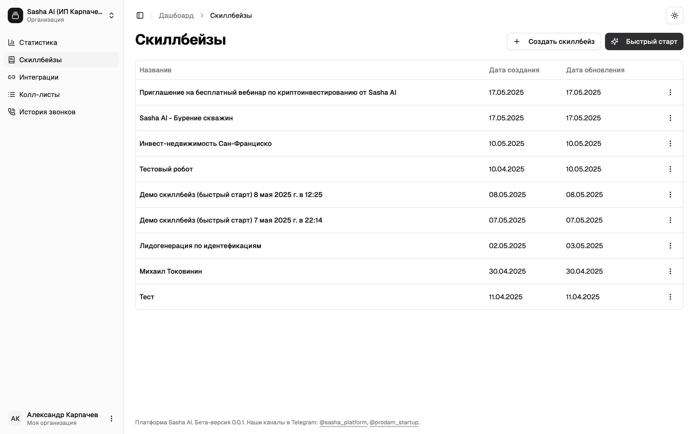
  </Accordion>
  <Accordion icon="message-square-dashed" title="Описание компании">
    В всплывающем окне расскажите чем занимается ваша компания, кому и с какой целью вы собираетесь звонить.
    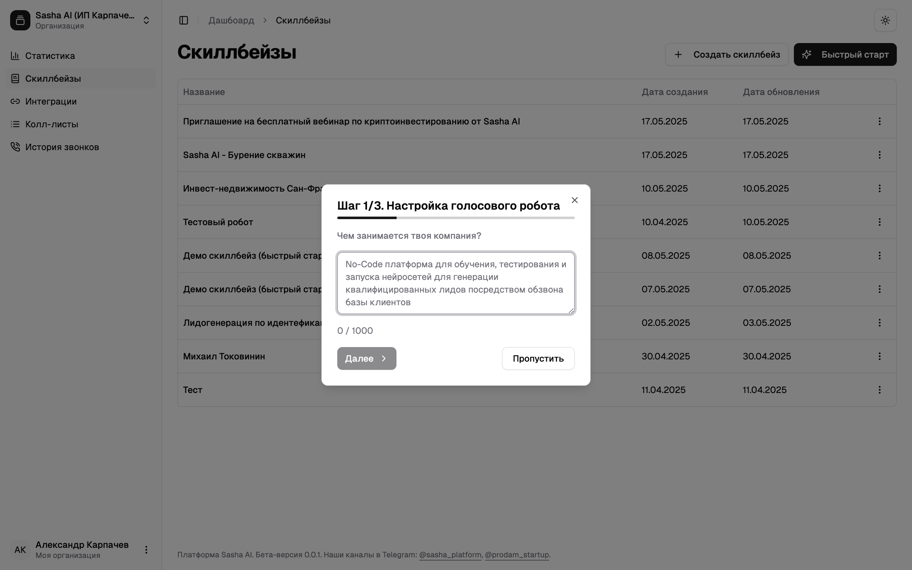
  </Accordion>
  <Accordion icon="phone" title="Тестирование">
    Протестируйте минимально-жизнеспособную версию оператора по тестовому номеру телефона.
    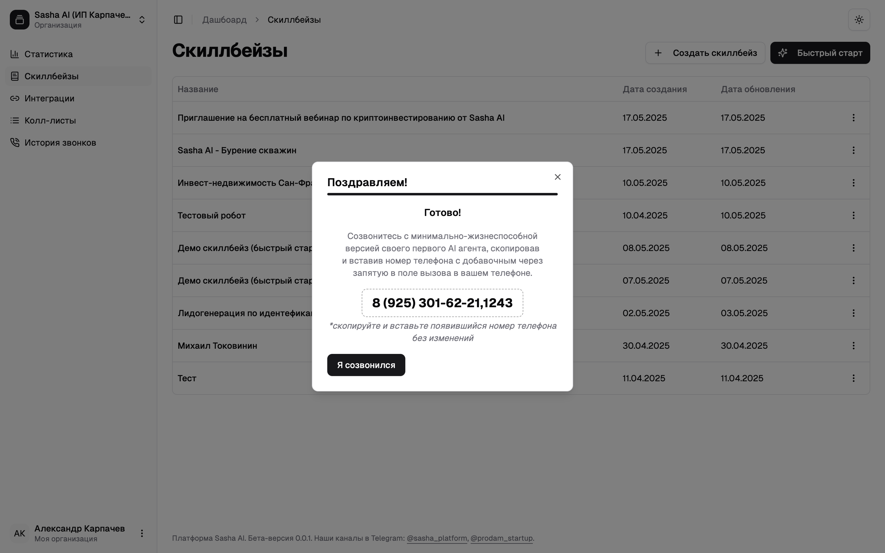
  </Accordion>
</AccordionGroup>

### Шаг 2. Подключите интеграцию с Telegram

<AccordionGroup>
  <Accordion icon="list" title="Создание колл-листа">
    Перейдите в раздел «Колл-листы», нажмите на кнопку «Создать новый»
    
  </Accordion>
  <Accordion icon="webhook" title="Настройка вебхука">
    Перейдите во вкладку «Вебхуки», нажмите на кнопку «Создать новый». В выпадающем списке выберите передачу лидов в
    телеграмм — «Telegram»
    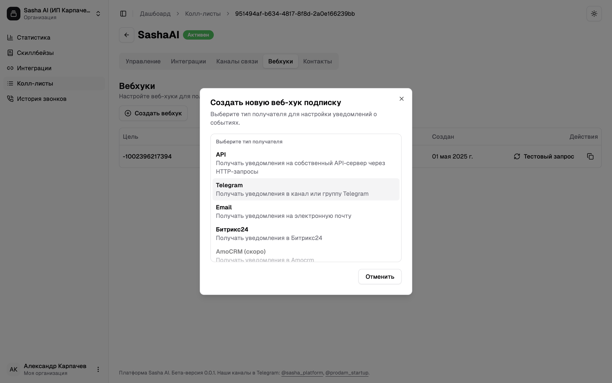
  </Accordion>
  <Accordion icon="telegram" title="Настройка Telegram">
    Проследуйте инструкции, вставьте ID чата в всплывающем окне, выберите событие «Только лиды», проверьте интеграцию и
    нажмите на кнопку «Создать».
    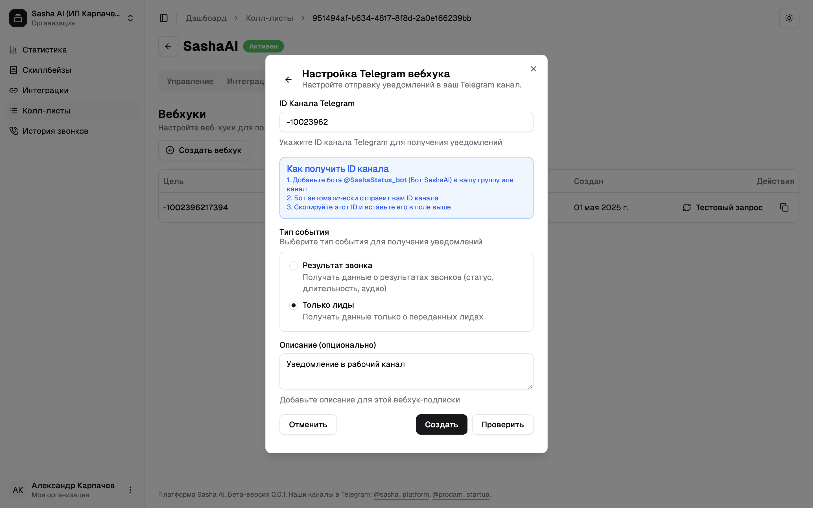
  </Accordion>
</AccordionGroup>

### Шаг 3. Загрузите базу клиентов

<AccordionGroup>
  <Accordion icon="brain" title="Настройка скиллбейса">
    В ранее созданном колл-листе перейдите в «Управление», в поле «Скиллбейсы» выберите настроенный с помощью функции
    «Быстрый старт» скиллбейс и нажмите на кнопку «Загрузить контакты»
    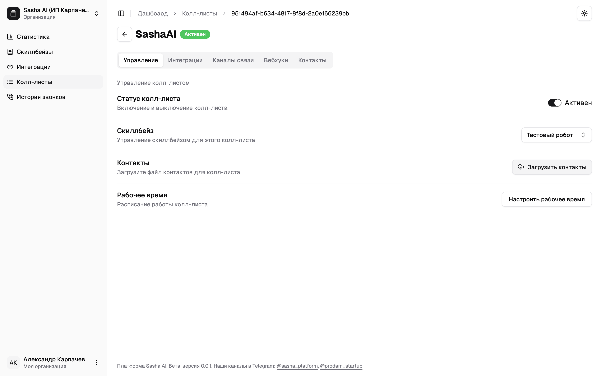
  </Accordion>
  <Accordion icon="download" title="Скачивание шаблона">
    Скачайте шаблон базы контактов из всплывающего окна.
    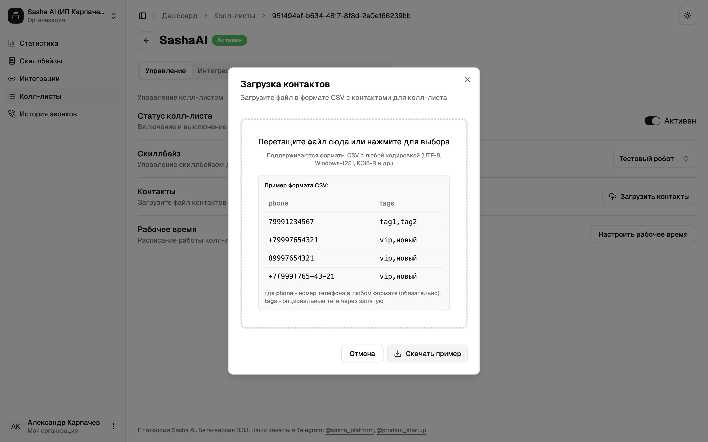
  </Accordion>
  <Accordion icon="upload" title="Загрузка базы">
    Сформируйте базу клиентов в формате CSV по шаблону, указанному на скриншоте. Загрузите ее на платформу, проверьте
    соответствие загрузки с помощью функции «Предварительный просмотр» и нажмите на кнопку «Загрузить».
    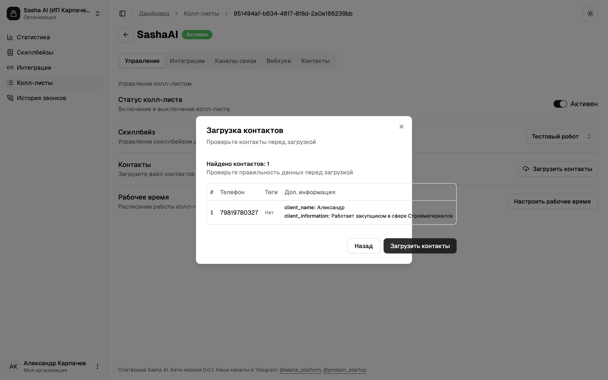
  </Accordion>
  <Accordion icon="check" title="Проверка">
    Готово! Вы можете проверить загруженные контакты с функцией «Предпросмотр».
    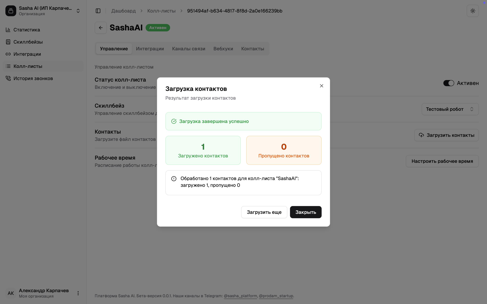
  </Accordion>
</AccordionGroup>

### Шаг 4. Запустите прозвон

<AccordionGroup>
  <Accordion icon="play" title="Активация прозвона">
    Не выходя из созданного колл-листа перейдите в раздел «Управление» и активируйте прозвон с помощью ползунка «Статус
    колл-листа»
    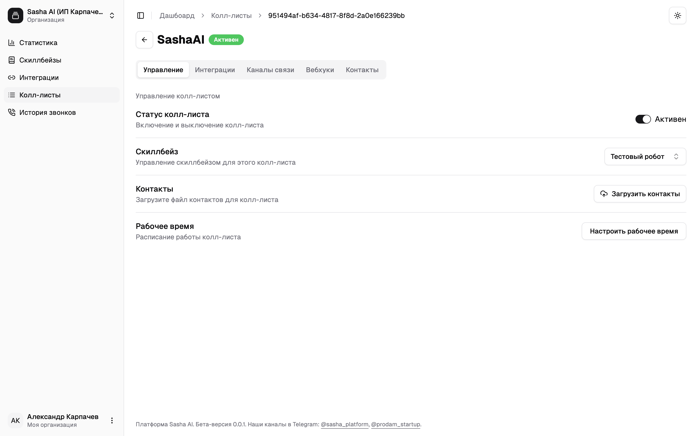
  </Accordion>
  <Accordion icon="list" title="Просмотр результатов">
    Готово! Если вы сделали все правильно и сейчас рабочее время — результаты обзвона отобразятся в разделе «История
    звонков»
    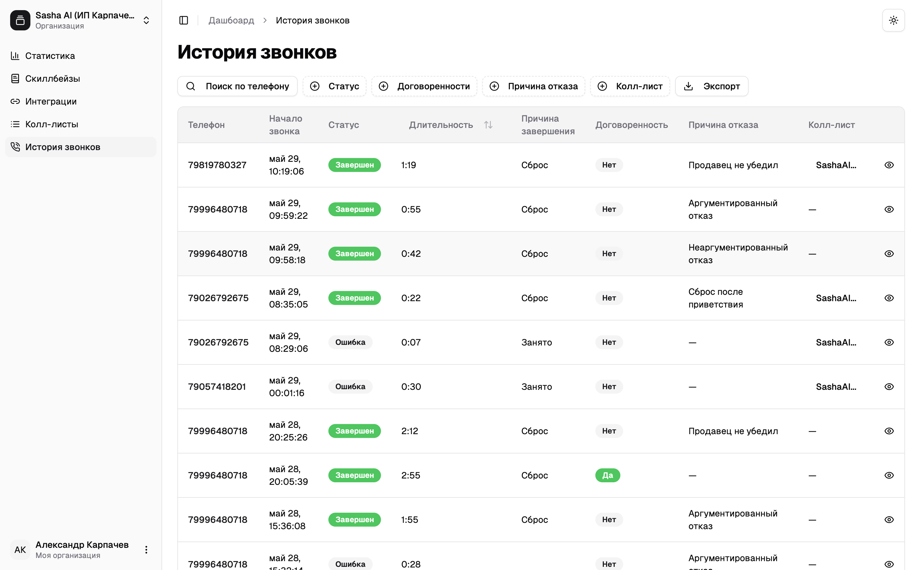
  </Accordion>
</AccordionGroup>
